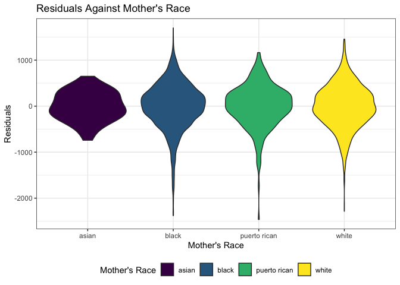
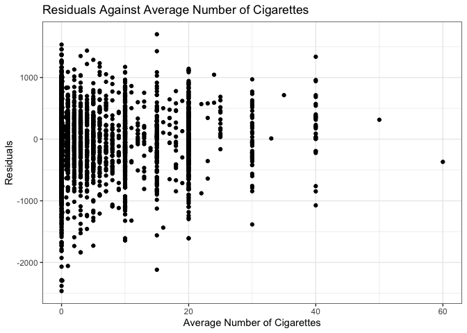

p8105\_hw6\_yw3438
================
Yuning Wang
11/15/2019

## Problem 1

``` r
birthweight = 
  read_csv("./data/birthweight.csv") %>% 
  janitor::clean_names() %>% 
  mutate(
    babysex = factor(recode(babysex, "1" = "male", "2" = "female")),
    frace = factor(recode(frace, "1" = "white", "2" = "black", "3" = "asian",
                   "4" = "puerto rican", "8" = "other", "9" = "unknow")),
    malform = factor(recode(malform, "0" = "absent", "1" = "present")),
    mrace = factor(recode(mrace,  "1" = "white", "2" = "black", "3" = "asian",
                   "4" = "puerto rican", "8" = "other"))
  )
```

The birth weight is an outcome that may depend on ‘average number of
cigarettes smoked per day during pregnancy’ and ‘mother’s race’. We fit
the initial model in the following code.

``` r
fit = lm(bwt ~ smoken + mrace, data = birthweight)
# read the results of the model
fit %>% 
  broom::tidy() %>% 
  select(term, estimate, p.value) %>% 
  mutate(term = str_replace(term, "^mrace", "Race: ")) %>% 
  knitr::kable(digits = 3)
```

| term               |  estimate | p.value |
| :----------------- | --------: | ------: |
| (Intercept)        |  3149.059 |   0.000 |
| smoken             |  \-11.163 |   0.000 |
| Race: black        | \-173.999 |   0.019 |
| Race: puerto rican |  \-61.893 |   0.438 |
| Race: white        |   185.213 |   0.013 |

The plot of model residuals against fitted values are as followed.

  - Residuals against ‘mother’s race’

<!-- end list -->

``` r
birthweight %>% 
  modelr::add_residuals(fit) %>% 
  ggplot(aes(x = mrace, y = resid, fill = mrace)) +
  geom_violin() +
  labs(
    title = "Residuals Against Mother's Race",
    x = "Mother's Race",
    y = "Residuals"
  ) +
  theme_bw() +
  theme(legend.position = "bottom") +
  viridis::scale_fill_viridis(
    name = "Mother's Race",
    discrete = T)
```

<!-- -->

  - Residuals against ‘average number of cigarettes smoked per day
    during pregnancy’

<!-- end list -->

``` r
birthweight %>% 
  modelr::add_residuals(fit) %>% 
  ggplot(aes(x = smoken, y = resid)) +
  geom_point() +
  labs(
    title = "Residuals Against Average Number of Cigarettes",
    x = "Average Number of Cigarettes",
    y = "Residuals"
  ) +
  theme_bw() 
```

<!-- -->
